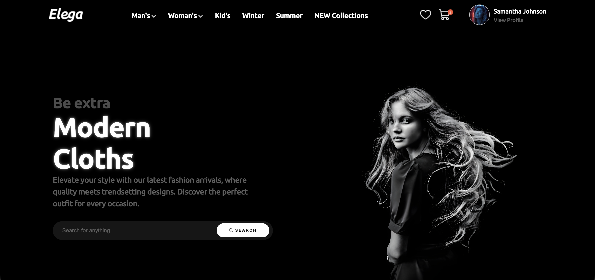
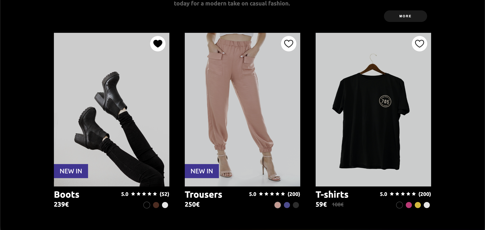

# Elega Landing Page

A modern and responsive e-commerce landing page built with HTML and CSS.

---

## 🔗 Live Demo

[View Live Project](https://elega-landing-page.vercel.app/)

---

## Preview

---

## Features

- Responsive layout
- Modern UI design
- Navigation menu
- Hero section with call-to-action
- Product showcase section
- Category cards
- Footer with structured links

---

## Tech Stack

- HTML
- CSS

---

## Goal

Practice building a clean and modern e-commerce landing page with strong UI/UX focus.
